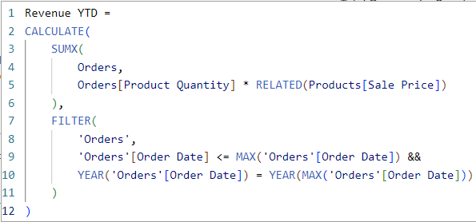

# Data Analytics Power BI Report
This project is to produce a report that will present a high-level business summary tailored for C-suite executives, and also give insights into their highest value customers segmented by sales region, provide a detailed analysis of top-performing products categorised by type against their sales targets, and a visually appealing map visual that spotlights the performance metrics of their retail outlets across different territories.

The project will be based on the following scenario:

A medium-sized international retailer who is keen on elevating their business intelligence practices. With operations spanning across different regions, they've accumulated large amounts of sales from disparate sources over the years.

Recognizing the value of this data, they aim to transform it into actionable insights for better decision-making. The goal is to use Microsoft Power BI to design a comprehensive Quarterly report. This will involve extracting and transforming data from various origins, designing a robust data model rooted in a star-based schema, and then constructing a multi-page report.

## Importing the data
This project consists of multiple data tables which needs to be imported in a varity of ways.

- **Orders**: This table was imported from a Azure SQL Database thus this was the option which needed to be chosen under the Azure heading when using the get data function. After inputting the correct database details, some transfomations needed to be performed in orded to get the data in a useable format. First the column named [Card Number] needed to be deleted to ensure data privacy. Then the [Order Date] and [Shipping Date] columns needed to be separated usuing the Split Column feature into two distinct columns each: one for the date and another for the time. Due to the [Order Date] column having missing or null values, these had to be filtered out and removed to maintain data integrity. This could be done using the drop down filter at the top of the column and unselecting the null value. Finally some columns had to be renamed to align with Power BI naming conventions, ensuring consistency and clarity in the report.

- **Products**: To load this data into the project the Text/CSV option from get data is needed. In the Data view, the Remove Duplicates function is used on the product_code column to ensure each product code is unique. The Column From Examples feature in Power Query Editor, was then used to generate two new columns from the weight column - one for the weight values and another for the units (e.g. kg, g, ml). For the values column, the data type needed to be converted to a decimal number. Then replace any error values in this column with the number 1. Next a new weight in kg column is created so the weight unit is consistent. Finally any redundant columns are deleted using the Power Query Editor.

- **Stores**: The Get Data option is used to connect to Azure Blob Storage and import the Stores table into the project. Then the columns in the dataset were renamed to align with Power BI naming conventions, ensuring clarity and consistency in the report.

- **Customers**: Unlike the other tables, this table is made up from multiple CSV files. These CSV files come from a folder inside a zip file, each with the same column format, one for each of the regions in which the company operates. Using the Get Data option in Power BI to import the Customers folder into the project by the Folder data connector. Combine and Transform is used to import the data. Power BI automatically appended the three files into one query. Then a Full Name column was created by combining the [First Name] and [Last Name] columns.

## Data Model

**Date Table:** The date table runs from the start of the year containing the earliest date in the Orders['Order Date'] column to the end of the year containing the latest date in the Orders['Shipping Date'] column. This is the DAX formula that was used to create the Date Table:
 
Dates = CALENDAR(DATE(YEAR(MIN(Orders[Order Date])), 1, 1), DATE(YEAR(MAX(Orders[Shipping Date])), 12, 31))
 

Then the following columns are added to the date table:

- Day of Week = FORMAT([Date], "dddd")
- Month Number (i.e. Jan = 1, Dec = 12 etc.) = [Date].[MonthNo]
- Month Name = [Date].[Month]
- Quarter = [Date].[Quarter]
- Year = [Date].[Year]
- Start of Year = STARTOFYEAR(Dates[Date])
- Start of Quarter = STARTOFQUARTER(Dates[Date])
- Start of Month = STARTOFMONTH(Dates[Date])
- Start of Week = [Date] - WEEKDAY([Date], 2) + 1

**Schema:** The relationships should form a star schema as follows:
- Orders[product_code] to Products[product_code]
- Orders[Store Code] to Stores[store code]
- Orders[User ID] to Customers[User UUID]
- Orders[Order Date] to Date[date]
- Orders[Shipping Date] to Date[date]

**Measures Table:**
This table will be used to store the measures created throughout the project to keep them orgainsed and not cluster the original tables.

The first addition to this table will be some of the key measures:

- Total Orders that counts the number of orders in the Orders table.
 

- Total Revenue that multiplies the Orders[Product Quantity] column by the Products[Sale_Price] column for each row, and then sums the result.
 

- Total Profit which performs the following calculation: For each row, subtract the Products[Cost_Price] from the Products[Sale_Price], and then multiply the result by the Orders[Product Quantity]. Sums the result for all rows.
 

- Total Customers that counts the number of unique customers in the Orders table. This measure needs to change as the Orders table is filtered, so do not just count the rows of the Customers table!
 

- Total Quantity that counts the number of items sold in the Orders table.
 

- Profit YTD that calculates the total profit for the current year.
 

- Revenue YTD that calculates the total revenue for the current year.
 

- Note: In the DAX formula for both Profit and Revenue, the filter used from lines 7 to 11 works by checking if the order date is in the same year as the year as the max order date and then checking if this date is less than or equal to the max order date.

**Date and Geography Hierarchies:**

<u>Date hierarchy:</u>
- Start of Year
- Start of Quarter
- Start of Month
- Start of Week
- Date

<u>Geography hierarchy:</u>
- World Region
- Country
- Country Region

## Building the Customer Details Page

**Headline Card Visuals:** Two visuals at the top of the page to highlight important information in an easily digestible format.

For the <b>Unique Customers visual</b>, add a card visual for the [Total Customers] measure and rename the field.

For the <b>Revenue per Customer visual</b>, a new [Revenue per Customer] measure is needed. This should be the [Total Revenue] divided by the [Total Customers].
 
The card visuals side by side:
 

**Summary Charts:** These charts can be found underneath the card visuals. Each chart will provide information about the total customers.

- The Donut Chart visual created shows the total customers for each country, using the Users[Country] column to filter the [Total Customers] measure.
 

- The Column Chart visual shows the number of customers who purchased each product category, using the Products[Category] column to filter the [Total Customers] measure.
 

**Line Chart:** The Line Chart visual shows [Total Customers] on the Y axis, and the Date Hierarchy for the X axis. Allowing users to drill down to the month level, but not to weeks or individual dates. With the addition of a trend line, and a forecast for the next 10 periods with a 95% confidence interval.
 

**Top 20 Customers Table:** This displays the top 20 customers, filtered by revenue. It shows each customer's full name, revenue, and number of orders. Conditional formatting has been applied to the revenue column, to display data bars for the revenue values (seen in green in the image below). This makes it much clearer to see which customer has brought in the most revenue.
 

**Top Customer Cards:** A set of three card visuals that provide insights into the top customer by revenue. They display the top customer's name, the number of orders made by the customer, and the total revenue generated by the customer.
 

**Date Slicer:** A slicer in the between slicer style to allow users to filter the page by year.
 

**Page View:**
 