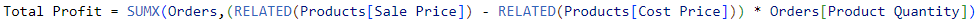
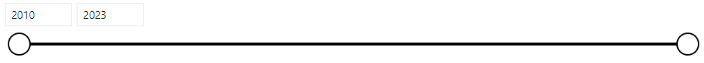
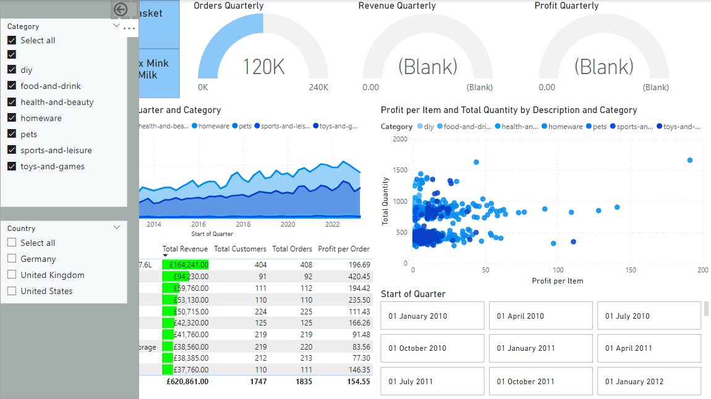

# Data Analytics Power BI Report
This project is to produce a report that will present a high-level business summary tailored for C-suite executives, and also give insights into their highest value customers segmented by sales region, provide a detailed analysis of top-performing products categorised by type against their sales targets, and a visually appealing map visual that spotlights the performance metrics of their retail outlets across different territories.

The project will be based on the following scenario:

A medium-sized international retailer who is keen on elevating their business intelligence practices. With operations spanning across different regions, they've accumulated large amounts of sales from disparate sources over the years.

Recognizing the value of this data, they aim to transform it into actionable insights for better decision-making. The goal is to use Microsoft Power BI to design a comprehensive Quarterly report. This will involve extracting and transforming data from various origins, designing a robust data model rooted in a star-based schema, and then constructing a multi-page report.

## Importing the data
This project consists of multiple data tables which needs to be imported in a varity of ways.

- **Orders**: This table was imported from a Azure SQL Database thus this was the option which needed to be chosen under the Azure heading when using the get data function. After inputting the correct database details, some transfomations needed to be performed in orded to get the data in a useable format. First the column named [Card Number] needed to be deleted to ensure data privacy. Then the [Order Date] and [Shipping Date] columns needed to be separated usuing the Split Column feature into two distinct columns each: one for the date and another for the time. Due to the [Order Date] column having missing or null values, these had to be filtered out and removed to maintain data integrity. This could be done using the drop down filter at the top of the column and unselecting the null value. Finally some columns had to be renamed to align with Power BI naming conventions, ensuring consistency and clarity in the report.

- **Products**: To load this data into the project the Text/CSV option from get data is needed. In the Data view, the Remove Duplicates function is used on the product_code column to ensure each product code is unique. The Column From Examples feature in Power Query Editor, was then used to generate two new columns from the weight column - one for the weight values and another for the units (e.g. kg, g, ml). For the values column, the data type needed to be converted to a decimal number. Then replace any error values in this column with the number 1. Next a new weight in kg column is created so the weight unit is consistent. Finally any redundant columns are deleted using the Power Query Editor.

- **Stores**: The Get Data option is used to connect to Azure Blob Storage and import the Stores table into the project. Then the columns in the dataset were renamed to align with Power BI naming conventions, ensuring clarity and consistency in the report.

- **Customers**: Unlike the other tables, this table is made up from multiple CSV files. These CSV files come from a folder inside a zip file, each with the same column format, one for each of the regions in which the company operates. Using the Get Data option in Power BI to import the Customers folder into the project by the Folder data connector. Combine and Transform is used to import the data. Power BI automatically appended the three files into one query. Then a Full Name column was created by combining the [First Name] and [Last Name] columns.

## Data Model

**Date Table:** The date table runs from the start of the year containing the earliest date in the Orders['Order Date'] column to the end of the year containing the latest date in the Orders['Shipping Date'] column. This is the DAX formula that was used to create the Date Table:
 

Then the following columns are added to the date table:

- Day of Week = FORMAT([Date], "dddd")
- Month Number (i.e. Jan = 1, Dec = 12 etc.) = [Date].[MonthNo]
- Month Name = [Date].[Month]
- Quarter = [Date].[Quarter]
- Year = [Date].[Year]
- Start of Year = STARTOFYEAR(Dates[Date])
- Start of Quarter = STARTOFQUARTER(Dates[Date])
- Start of Month = STARTOFMONTH(Dates[Date])
- Start of Week = [Date] - WEEKDAY([Date], 2) + 1

**Schema:** The relationships should form a star schema as follows:
- Orders[product_code] to Products[product_code]
- Orders[Store Code] to Stores[store code]
- Orders[User ID] to Customers[User UUID]
- Orders[Order Date] to Date[date]
- Orders[Shipping Date] to Date[date]

**Measures Table:**
This table will be used to store the measures created throughout the project to keep them orgainsed and not cluster the original tables.

The first addition to this table will be some of the key measures:

- Total Orders that counts the number of orders in the Orders table.
 

- Total Revenue that multiplies the Orders[Product Quantity] column by the Products[Sale_Price] column for each row, and then sums the result.
 

- Total Profit which performs the following calculation: For each row, subtract the Products[Cost_Price] from the Products[Sale_Price], and then multiply the result by the Orders[Product Quantity]. Sums the result for all rows.
 

- Total Customers that counts the number of unique customers in the Orders table. This measure needs to change as the Orders table is filtered, so do not just count the rows of the Customers table!
 

- Total Quantity that counts the number of items sold in the Orders table.
 

- Profit YTD that calculates the total profit for the current year.
 

- Revenue YTD that calculates the total revenue for the current year.
 

- Note: In the DAX formula for both Profit and Revenue, the filter used from lines 7 to 11 works by checking if the order date is in the same year as the year as the max order date and then checking if this date is less than or equal to the max order date.

**Date and Geography Hierarchies:**

<u>Date hierarchy:</u>
- Start of Year
- Start of Quarter
- Start of Month
- Start of Week
- Date

<u>Geography hierarchy:</u>
- World Region
- Country
- Country Region

## The Customer Details Page
The purpose of this page is provide an in-depth look at which Customers from all stores are spending the most, with the option to filter by time-frame and region.

**Headline Card Visuals:** Two visuals at the top of the page to highlight important information in an easily digestible format.

For the <b>Unique Customers visual</b>, add a card visual for the [Total Customers] measure and rename the field.

For the <b>Revenue per Customer visual</b>, a new [Revenue per Customer] measure is needed. This should be the [Total Revenue] divided by the [Total Customers].
 
The card visuals side by side:
 

**Summary Charts:** These charts can be found underneath the card visuals. Each chart will provide information about the total customers.

- The Donut Chart visual created shows the total customers for each country, using the Users[Country] column to filter the [Total Customers] measure.
 

- The Column Chart visual shows the number of customers who purchased each product category, using the Products[Category] column to filter the [Total Customers] measure.
 

**Line Chart:** The Line Chart visual shows [Total Customers] on the Y axis, and the Date Hierarchy for the X axis. Allowing users to drill down to the month level, but not to weeks or individual dates. With the addition of a trend line, and a forecast for the next 10 periods with a 95% confidence interval.
 

**Top 20 Customers Table:** This displays the top 20 customers, filtered by revenue. It shows each customer's full name, revenue, and number of orders. Conditional formatting has been applied to the revenue column, to display data bars for the revenue values (seen in green in the image below). This makes it much clearer to see which customer has brought in the most revenue.
 

**Top Customer Cards:** A set of three card visuals that provide insights into the top customer by revenue. They display the top customer's name, the number of orders made by the customer, and the total revenue generated by the customer.
 

**Date Slicer:** A slicer in the between slicer style to allow users to filter the page by year.
 

**Page View:**
 

## The Executive Summary Page
 The purpose of this page is to give an overview of the company's performance as a whole, so that C-suite executives can quickly get insights and check outcomes against key targets. 

**Card Visuals:** Three cards that span about half of the width of the page. One for Total Revenue, Total Orders and Total Profit measures. Using the Format > Callout Value pane to ensure no more than 2 decimal places in the case of the revenue and profit cards, and only 1 decimal place in the case of the Total Orders measure.
 

**Line Chart:** A copy of the line graph from the Customer Detail page, with the following changes:
- X axis set to the Date Hierarchy, with only the Start of Year, Start of Quarter and Start of Month levels displayed
- Y axis set to the Total Revenue

**Donut Charts:** A pair of donut charts, showing Total Revenue broken down by Store[Country] and Store[Store Type] respectively.
 

**Bar Chart:** A bar chart showing number of orders by product category. This can be completed quickly using the a copy of the Total Customers by Product Category donut chart from the Customer Detail page. Using the on-object Build a visual pane and changing the visual type to Clustered bar chart.Also the X axis field needs to be changed from Total Customers to Total Orders.
 

**KPI Visuals:** To make KPIs for Quarterly Revenue, Orders and Profit a set of new measures for the quarterly targets need me be made. These measure are:
1. Previous Quarter Profit
2. Previous Quarter Revenue
3. Previous Quarter Orders
4. 5% Target growth in each measure compared to the previous quarter

KPI for the revenue: The Value field is Total Revenue, Trend Axis set to Start of Quarter and Target is Target Revenue

In the Format pane,the values are set as follows:
- Trend Axis: on
- Direction : High is Good
- Bad Colour : red
- Transparency : 15%
- The Callout Value set to show only to 1 decimal place.

The KPI's for orders and profit are made in the same way but with their respective Total's and Target's.
 

**Page View:**
 

## The Product Detail Page
The purpose of this page is provide an in-depth look at which products within the inventory are performing well, with the option to filter by product and region.

**Gauge Visuals:** A set of three gauges, showing the current-quarter performance of Orders, Revenue and Profit against a quarterly target, with a 10% quarter-on-quarter growth target in all three metrics.

To achieve this new DAX measures for the three metrics, and for the quarterly targets of each metric. The DAX formula for Revenue provided below.
 
 

The maximum value of the gauges are set to the target, so that the gauge shows as full when the target is met. Conditional formatting is applied to the callout value (the number in the middle of the gauge), so that it shows as red if the target is not yet met, and blue otherwise.

  (This space is for a screen shot of the Gauge Visuals once they are working)

 

**Card Visuals:** For this page, two card visuals are used to display the top product by both total revenue and orders. This is achieved by using the filter pane and filtering Product[Description] by revenue and orders respectively then setting the filter type to Top N and then setting N to one.
 

**Area Chart:** An area chart that shows how the different product categories are performing in terms of revenue over time.
 This chart the following fields:
- X axis - Dates[Start of Quarter]
- Y axis - Total Revenue
- Legend - Products[Category]

 
This chart shows that there are clearly two categories (homeware and toys-and-games) which bring in the majority of the total revenue.

**Top Products Table:** The top 10 products table has the following fields:
- Product Description
- Total Revenue
- Total Customers
- Total Orders
- Profit per Order

 

**Scatter Graph:** This visual shows which product ranges are both top-selling items and also profitable. For this a new calculated column [Profit per Item] is needed in the Products table.
 
The visual is configured as follows:
- Values - Products[Description]
- X Axis - Products[Profit per Item]
- Y Axis - Products[Total Quantity]
- Legend - Products[Category]

 

**Slicer Toolbar:** Slicers allow users to control how the data on a page is filtered. Thus it would be ideal to have a pop-out toolbar which can be accessed from a navigation bar On the left-hand side of the report.

A button at the top of the navigation bar is used to open the slicer panel with the tooltip text set to Open Slicer Panel. The Slicer Panel is the same height as the page, and about 3-5X the width of the navigation bar itself. It contains two slicers, Product Category and Country respectively. A back button in the top right can hide the slicer toolbar when it's not in use.
 Panel closed: (Ignore the icons in the bottom left, these will be explained later in this document)
 
 Panel Open:
 

## Store Map Page

**Map Visual:** The Geography hierarchy is assigned to the Location field, and ProfitYTD to the Bubble size field.

The controls of the map are as follows:
- Auto-Zoom: On
- Zoom buttons: Off
- Lasso button: Off

**Country Slicer:** The slicer field is Stores[Country], and the slicer style is Tile.
 

**Stores Drillthrough Page:** The stores drillthough page summarises each store's performance. It includes the following visuals:
- A table showing the top 5 products, with columns: Description, Profit YTD, Total Orders, Total Revenue
- A column chart showing Total Orders by product category for the store
- Gauges for Profit YTD against a profit target of 20% year-on-year growth vs. the same period in the previous year. The gauges require additional measures: Profit Goal and Revenue Goal, which should be a 20% increase on the previous year's year-to-date

- A Card visual showing the currently selected store

The drillthough page can be seen below.
 

**Stores Tooltip:** This is what pops up when a location on the map visual is hoverd over. It consists of the profit guage and the store card visuals.
 

## Cross-Filtering and Navigation

**The cross-filtering:** 
1. Executive Summary Page: Product Category bar chart and Top 10 Products table have been changed to not filter the card visuals or KPIs

2. Customer Detail Page: 
- Top 20 Customers table no longer filters any of the other visuals 
- Total Customers by Product Donut Chart doesn't affect the Customers line graph 
- Total Customers by Country donut chart doesn't affect Total Customers by Product donut Chart

3. Product Detail Page: Orders vs. Profitability scatter graph and Top 10 Products table no longer filter any other visuals.

**Navigation Bar:** The navigation bar consists of four buttons for the individual report pages. There is a white version for the default button appearance, and a blue one so that the button changes colour when hovered over with the mouse pointer. (These are the ones mentioned in the slicer toolbar section above).
 

## Metrics for Users Outside the Company Using SQL

The data is stored on a Postgres database server hosted on Microsoft Azure.

The table and column names in this database are different from the ones in Power BI.

To help understand the differences, there is a 'Table information' folder of this project. This folder includes: 
- a list of the tables in the database
- a list of the columns in the table for each table

**SQL queries:** For this last section, there is another folder called 'SQL Questions'. This folder contains both a sql file and a csv file for each of the following questions:

1. How many staff are there in all of the UK stores?

2. Which month in 2022 has had the highest revenue?

3. Which German store type had the highest revenue for 2022?

4. Create a view where the rows are the store types and the columns are the total sales, percentage of total sales and the count of orders

5. Which product category generated the most profit for the "Wiltshire, UK" region in 2021?

